某一天早上，查看服务器的内存使用的时候，发现CPU超过了100%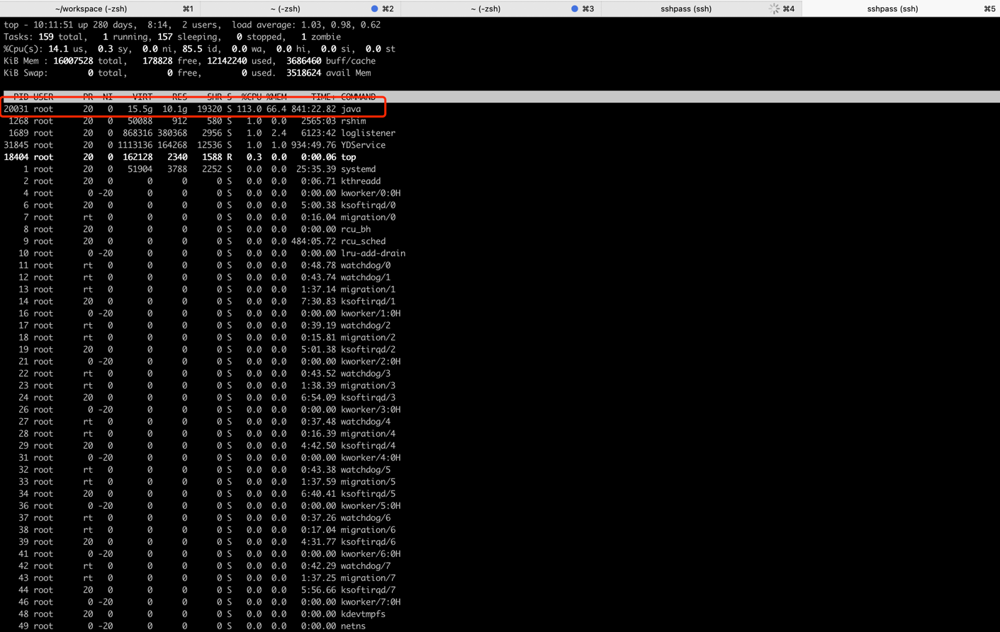
1. 找到最占用CPU的线程：top -Hp 20031 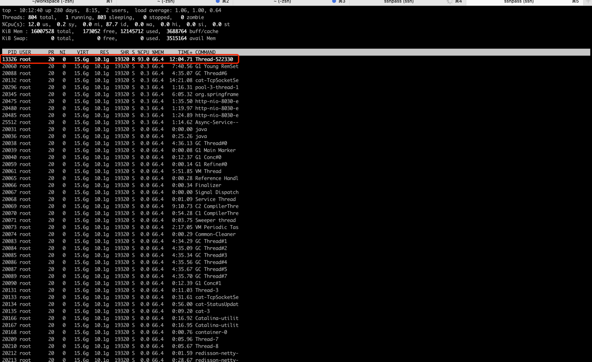
2. 线程id转十六进制：printf “%x\n” 13326
3. 查看线程堆栈：jstack 20031 | grep 340e -C 20 --color 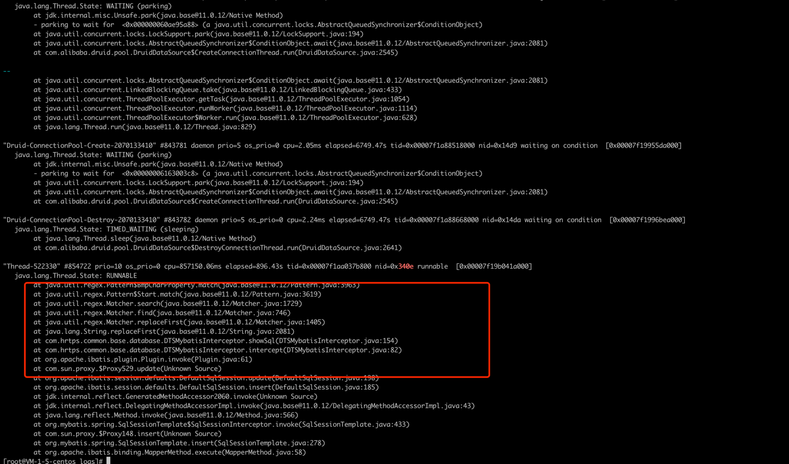
4. 这是一个Mybatis拦截器，同来做数据同步的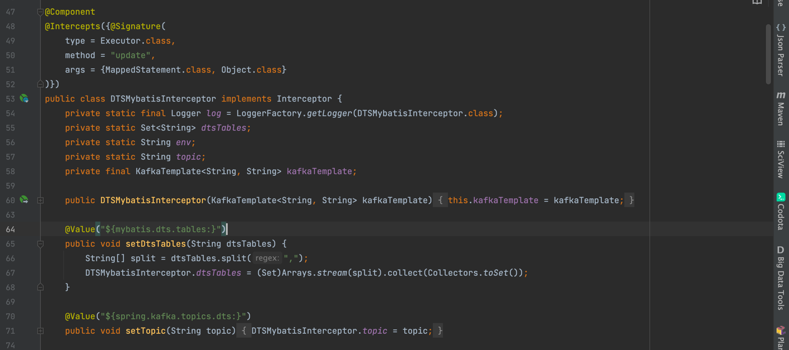，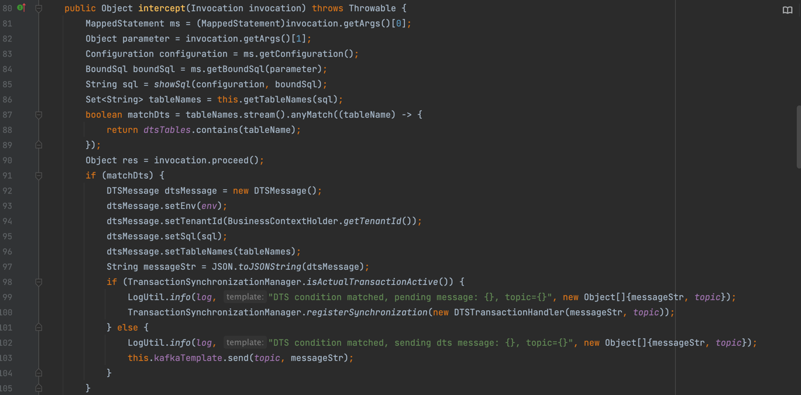，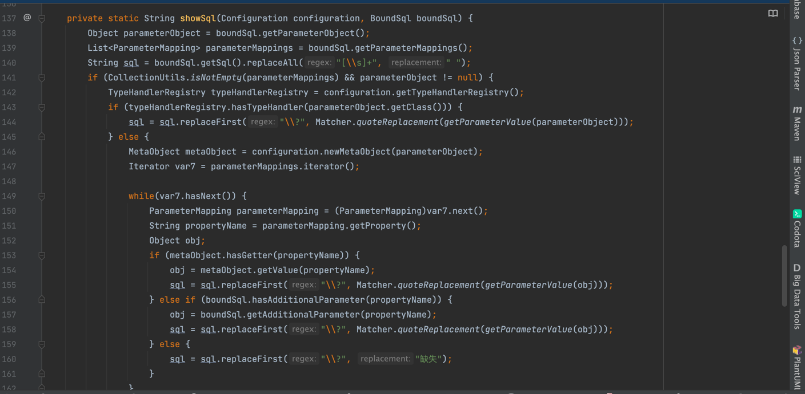
5. 用arthas查看方法的返回值：watch com.hrtps.common.base.database.DTSMybatisInterceptor showSql '{returnObj}'  -x 3 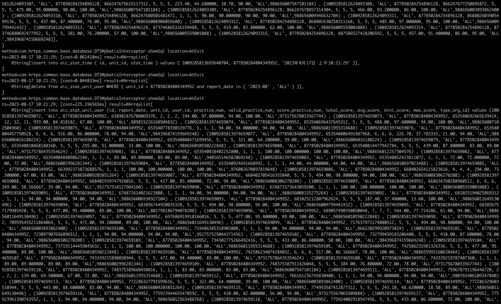
6. 发现所有select以外的SQL执行语句都经过了这个拦截器拼接完整SQL的逻辑，而如果执行语句很长，参数太多的话，在进行参数替换的时候非常耗费CPU
7. 并且这个拦截器被注册了2次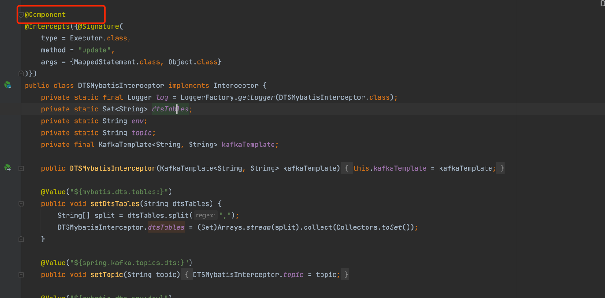，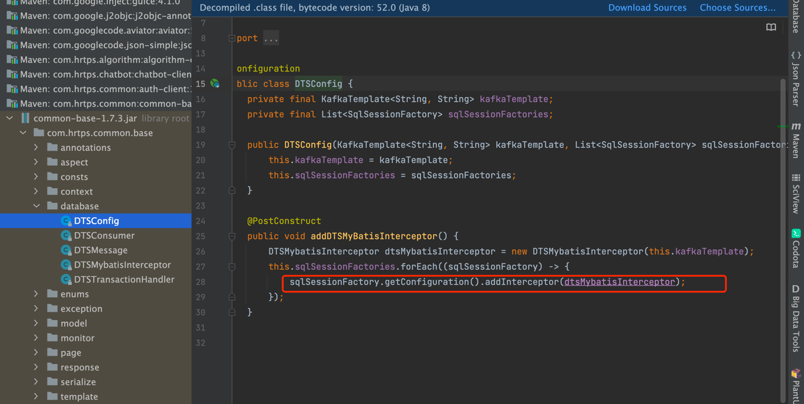，也就是说每一个sql语句执行时这个拦截器都会执行2次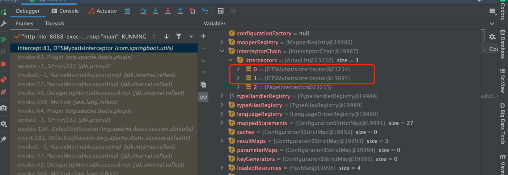，
8. 解决办法：1.让DTSMybatisInterceptor拦截器只注册一次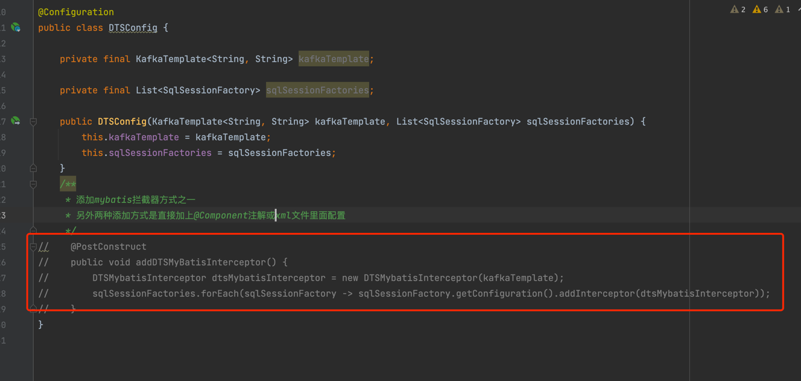，2.拦截器里面判断提前，只有需要同步数据的表才执行组装完整sql的逻辑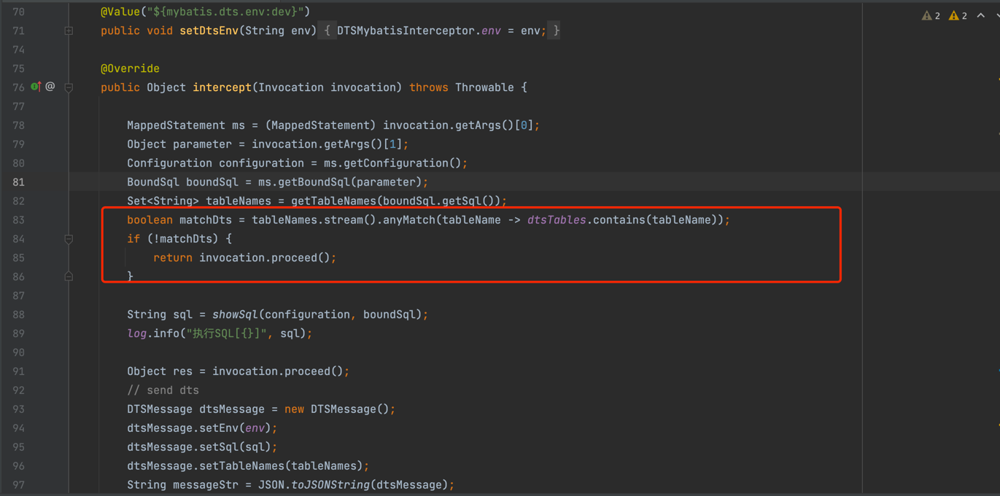
